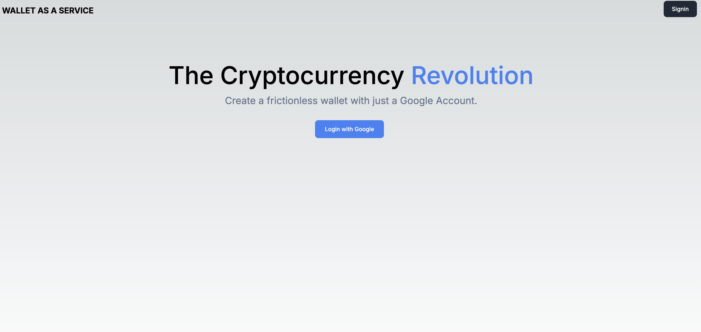
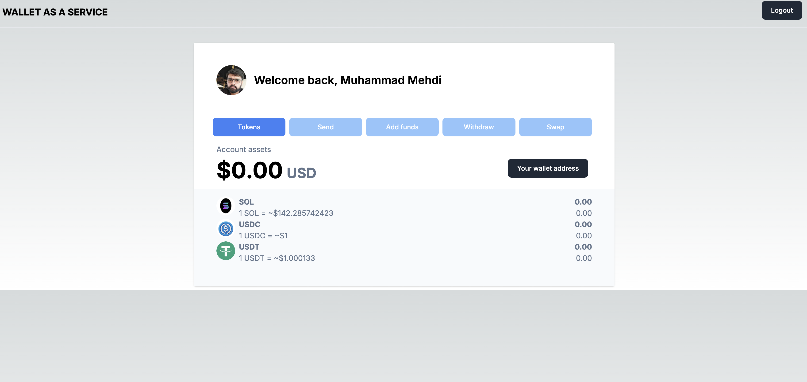

# WAAS Wallet as Service (MVP) WEB3
=====================================

=====================================

**Project Description:**
------------------------

WAAS (Wallet as a Service) is a Next.js project that provides a user-friendly cryptocurrency wallet experience , leveraging Google authentication for seamless sign-ups and logins.

## Getting Started
-------------------

### Prerequisites:
- Install Node.js (20 or later)
- Set up PostgreSQL database with the correct environment variables

## Authentication Setup
----------------------

For Google authentication, you'll need to set up a Google Client ID and Secret Key.

1. Create a new project on the [Google Cloud Console](https://console.cloud.google.com/).
2. Navigate to the "OAuth 2.0 clients" section.
3. Select "Web application," then fill in:
	* Authorized JavaScript origins: `http://localhost:3000` (or your local domain)
	* Authorized redirect URI: `http://localhost:3000/api/auth/callback/google`
4. Click "Create"
5. Note the Client ID and Secret Key; you'll need these for configuration

### Installation & Database setup Instructions:

1. Clone this repository: `git clone <repository-url>`
2. Navigate to the project directory: `cd waas-wallet-as-service`
3. Install dependencies: `npm install` (or use your preferred package manager, e.g., yarn or pnpm)
4. Update the `.env` file with your PostgreSQL database credentials and Google OAuth credentials (refer to the `.env.example` file for reference).
5. Run Prisma Migrate: `npx prisma migrate dev`
6. Verify that the schema is updated in your PostgreSQL database
7. Start the development server: `npm run dev`

Open [http://localhost:3000](http://localhost:3000) with your browser to see the result.

Remember to set the environment variables and configure authentication in your code. You can find more information about these topics in the official Next.js documentation, Prisma documentation, or Google Cloud Console help resources.

## Contact
-------------

If you have any questions or would like to get involved in this project, please feel free to reach out:

* Email: mmmbukhari@gmail.com

I'm excited to collaborate and build this project further!